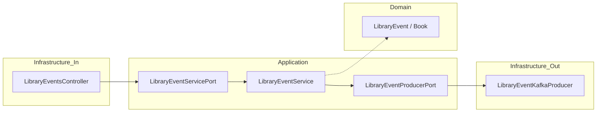

# Requirements

### Overview & Goals
Implement a Spring Boot REST API that acts as a Kafka producer for library events using Hexagonal Architecture (Ports and Adapters). The service will expose endpoints to create and update library events, validate payloads, and publish them to a Kafka topic.

### Scope
- **In Scope**:
    - Hexagonal Architecture structure (Application, Domain, Infrastructure layers).
    - REST Endpoints: `POST` and `PUT` `/v1/library-events`.
    - Domain models for `LibraryEvent` and `Book`.
    - Kafka publishing logic with retry handling.
    - Testcontainers-based integration testing.
- **Out of Scope**:
    - Database persistence.
    - Authentication and Authorization.
    - Kafka consumer implementation.

### Functional Requirements
- **Create Event**: `POST` endpoint must accept a `LibraryEvent` with type `ADD`.
- **Update Event**: `PUT` endpoint must accept a `LibraryEvent` with type `UPDATE` and a non-null `libraryEventId`.
- **Kafka Publishing**: All valid events must be published to the `library-events` topic using the `libraryEventId` as the message key.
- **Validation**: Reject requests with missing mandatory fields (Book ID, Name, Author, Event Type).
- **Responses**: 201 for successful creation, 200 for successful update, 400 for validation errors, and 500 for Kafka failures.

# Technical Design

### Current Implementation
- Minimal Spring Boot 4.1.0 project with Java 25.
- Dependencies for Kafka, Web, and Validation are already present in `build.gradle`.

### Proposed Architecture
Hexagonal Architecture (Ports and Adapters) to decouple core business logic from infrastructure concerns:
- **Domain Layer**: Contains pure business models and rules.
- **Application Layer**: Contains Input/Output Ports (interfaces) and the Service implementation (orchestration).
- **Infrastructure Layer**: Contains Adapters for Web (Inbound) and Kafka (Outbound), plus configuration.

### Key Decisions
- **Hexagonal Architecture**: Use Ports and Adapters to ensure the domain is independent of Kafka and Web frameworks.
- **Java Records**: Use `record` for `LibraryEvent` and `Book` for immutability and conciseness.
- **Testcontainers**: Use Testcontainers for realistic integration tests with a live Kafka container.
- **KafkaTemplate**: Use `KafkaTemplate<Integer, String>` (JSON) in the Kafka adapter.
- **Sync Response**: The service will wait for the Kafka producer result to ensure proper HTTP status codes (201/200 vs 500).
- **Null Key for ADD**: Follow the default partitioning strategy for new events where `libraryEventId` is null.

### File Structure
```text
src/main/java/com/alejandro/
├── application/
│   ├── port/
│   │   ├── in/
│   │   │   └── LibraryEventServicePort.java
│   │   └── out/
│   │       └── LibraryEventProducerPort.java
│   └── service/
│       └── LibraryEventService.java
├── domain/
│   ├── model/
│   │   ├── Book.java
│   │   ├── LibraryEvent.java
│   │   └── LibraryEventType.java
├── infrastructure/
│   ├── adapter/
│   │   ├── in/
│   │   │   └── web/
│   │   │       ├── LibraryEventsController.java
│   │   │       └── LibraryEventsControllerAdvice.java
│   │   └── out/
│   │       └── kafka/
│   │           └── LibraryEventKafkaProducer.java
│   └── config/
│       └── KafkaConfig.java
└── LibraryEventsProducerV2Application.java
```

### Architecture Diagram


# API Specification

### API Endpoints

#### POST `/v1/library-events`
- **Request Body**: `LibraryEvent`
- **Constraints**: `libraryEventType` must be `ADD`.
- **Response**: `201 Created` with the echoed event.

#### PUT `/v1/library-events`
- **Request Body**: `LibraryEvent`
- **Constraints**: `libraryEventType` must be `UPDATE`, `libraryEventId` is mandatory.
- **Response**: `200 OK` with the echoed event.

### Validation Rules
 Field | Type | Rules |
-------|------|-------|
 `libraryEventId` | Integer | Required for `UPDATE`. |
 `libraryEventType` | Enum | Must be `ADD` or `UPDATE`. |
 `book` | Object | Not null. |
 `book.bookId` | Integer | Not null. |
 `book.bookName` | String | Not blank. |
 `book.bookAuthor` | String | Not blank. |

# Testing Strategy

### Validation Approach
- **Unit Testing**:
    - Test domain model validation.
    - Test `LibraryEventService` using mocks for Ports.
- **Integration Testing**:
    - Use `@SpringBootTest` with **Testcontainers** to verify the end-to-end flow from REST call to a real Kafka instance.
    - Verify message content and key in the Kafka topic.

### Key Scenarios
1. **Happy Path POST**: Valid `ADD` event returns 201 and message is in Kafka.
2. **Happy Path PUT**: Valid `UPDATE` event with ID returns 200 and message is in Kafka.
3. **Validation Failure**: Missing `bookName` returns 400 with descriptive error.
4. **Kafka Failure**: If Kafka is down, the API returns 500 after configured retries.

# Delivery Steps

###   Step 1: Domain Models and Ports Definition
The core domain models and port interfaces are defined and ready for implementation.

- Define `LibraryEventType` enum (`ADD`, `UPDATE`).
- Create `Book` and `LibraryEvent` records in `domain.model` with Bean Validation annotations (`@NotNull`, `@NotBlank`).
- Define `LibraryEventServicePort` (inbound) and `LibraryEventProducerPort` (outbound) interfaces in the `application.port` package.

###   Step 2: Application Service and Web Adapter
The business logic is orchestrated and exposed via a REST API.

- Implement `LibraryEventService` that coordinates between the inbound port and outbound port.
- Create `LibraryEventsController` as the inbound adapter, implementing the REST endpoints and triggering validation.
- Implement `LibraryEventsControllerAdvice` for global exception handling (Validation and Kafka errors).

###   Step 3: Kafka Infrastructure Adapter and Config
Library events are published to the Kafka topic using the outbound adapter.

- Implement `LibraryEventKafkaProducer` as the outbound adapter using `KafkaTemplate`.
- Configure `KafkaConfig` to define the `library-events` topic and producer settings.
- Ensure the producer uses the `libraryEventId` as the key (null for `ADD` events) and JSON for the value.

###   Step 4: Integration Testing with Testcontainers
The end-to-end flow is verified using a real Kafka environment in a container.

- Add `testcontainers` and `kafka` test dependencies to `build.gradle`.
- Implement an integration test using `@SpringBootTest` and `@Testcontainers`.
- Verify that both `POST` and `PUT` requests result in correct messages being published to the Kafka container.
- Update `compose.yaml` to include Kafka and Zookeeper for local development support.